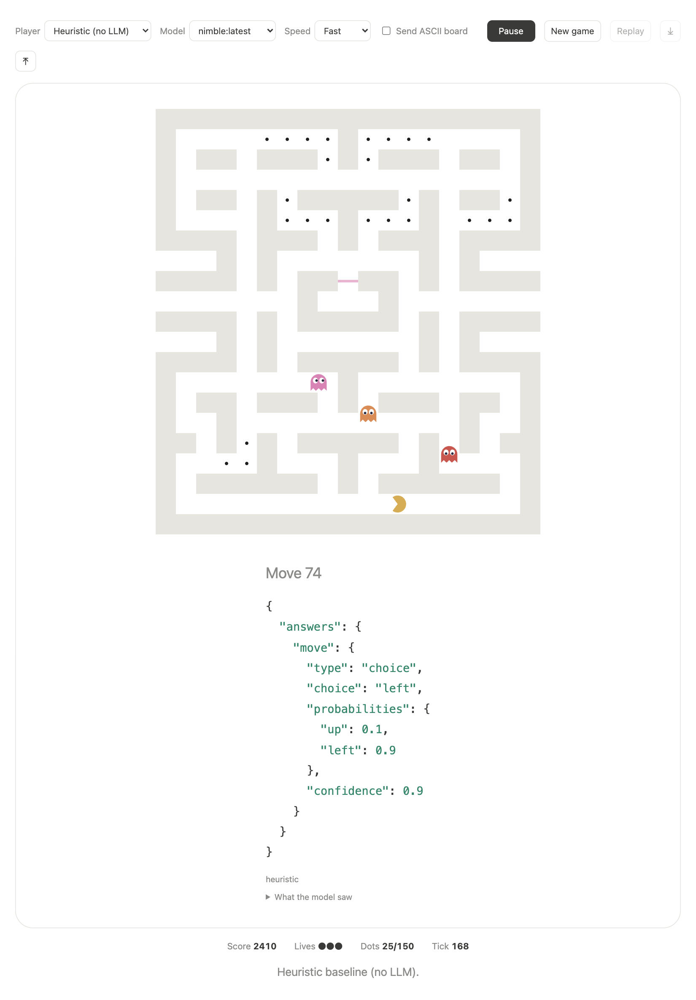

# Pac-Man × Ollama System One

Pac-Man played by a local decision model. At every junction the game sends
the position to Ollama's System One API (`/v1/systemone`) as a `choice`
question. The model returns a probability for each legal direction, and
Pac-Man takes the most likely one. Everything runs on your machine.



## Requirements

- Ollama **0.35+** (`ollama --version`)
- A System One decision model: `ollama pull nimble` (Nimble 9B; Tev1 4B / 0.8B also work)
- Node.js 18+ (no npm dependencies)

## Run

```sh
npm start            # → http://localhost:3000
```

Environment variables: `PORT` (default `3000`), `OLLAMA_HOST` (default `http://localhost:11434`).

Controls:

- **Player**: Ollama System One, a heuristic baseline (no LLM), or yourself on the arrow keys / WASD.
- **Space**: start or pause.
- **Replay**: re-runs the last game, waiting as long as the model took on each decision, so you see it at real-time speed. The ⤓ / ⤒ buttons save and load replays as JSON.
- **What the model saw**: shows the exact request for the current move.
- **Send ASCII board**: also sends the maze as text. This is off by default because it adds ~220 tokens (~350 ms per call on Nimble) without better play in testing.

## How a decision works

```jsonc
// POST /v1/systemone
{
  "model": "nimble",
  "state": { "pacman": { "row": 15, "col": 9, "facing": "left" }, "ghosts": [ ... ], "dots_remaining": 133, ... },
  "questions": {
    "move": {
      "type": "choice",
      "instructions": "You are playing Pac-Man. Choose the direction ...",
      "criteria": {
        "up":   "SAFE. Move up. Plenty of room ahead of the ghosts. Nearest dot 1 step(s) (closest of all options). 12 dots within 8 steps (most of all options).",
        "down": "TRAPPED. Move down. Ghosts can cut this route off: only 3 tiles reachable ahead of them. Nearest dot 2 step(s). 2 dots within 8 steps. Reverses direction."
      }
    }
  }
}
// → { "answers": { "move": { "type": "choice", "choice": "up", "probabilities": { "up": 0.94, "down": 0.06 }, "confidence": 0.67 } } }
```

Only legal directions are offered. The model isn't trained on Pac-Man, so
the game does the spatial reasoning and the model weighs the conclusions. Each
option's description starts with a verdict:

- **SAFE**: plenty of tiles Pac-Man can reach before any ghost can.
- **RISKY**: a ghost is near the next tile, but there is room to escape.
- **TRAPPED**: fewer than 8 tiles reachable ahead of the ghosts; they can cut the route off.
- **DEADLY**: a ghost reaches the next tile first.

Then it lists the nearest dot and dot count along that route. Labels such as
"closest of all options" are only given among the options with the best
verdict, so the model doesn't have to compare numbers across options. The
instructions refer to the same verdict words.

Safety is decided by the code, not the model: TRAPPED and DEADLY options are
left out whenever a SAFE or RISKY one exists. If only one move is left, Pac-Man
takes it without asking the model (System One needs at least two options).

The model is only asked at decision points: junctions, corners, the first
move, or when a ghost is within 4 tiles. In straight corridors Pac-Man keeps
going. The game is turn-based, so the world waits while the model thinks.

## Project layout

```
server.js            static server + /api/systemone proxy + /api/status
public/js/maze.js    layout and ghost config
public/js/game.js    deterministic engine (seeded; same seed + moves ⇒ same game)
public/js/agent.js   request builder, response parser, heuristic baseline
public/js/render.js  canvas drawing
public/js/main.js    UI, game loop, replay
scripts/simulate.js  headless games
test/                node:test suite
```

## Headless play & tests

```sh
npm test
node scripts/simulate.js --agent heuristic --games 10
node scripts/simulate.js --agent ollama --model nimble --games 3 [--board on]
```

On an M-series Mac, over seeds 1–10, Nimble wins 9 of 10 games (99.8% of dots
eaten on average), at ~500 ms per model call (warm).
